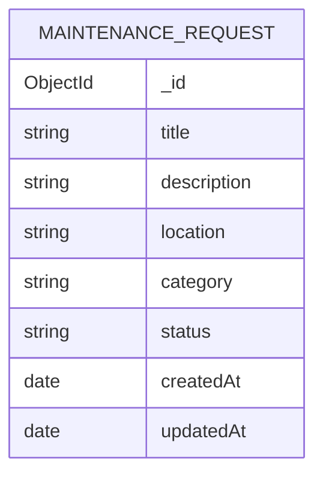

# Campus Maintenance Request System — Specification

## Problem
Students and staff need a simple way to report maintenance problems around campus and see whether reported problems are open or resolved.

## Users
- Reporter: a student or staff member who reports a maintenance problem.
- Campus community member: browses and filters reported maintenance requests.
- Authentication and role management are not required for this assignment.

## MVP features

### 1. Report a maintenance request
A request contains:
- `title` — required, non-empty string.
- `description` — required, non-empty string.
- `location` — required, non-empty string.
- `category` — required: `equipment`, `electrical`, `plumbing`, `facility`, or `other`.
- `status` — backend controlled; new requests start as `open`.
- `createdAt` and `updatedAt` — timestamps.

The client must not choose the initial status.

### 2. Browse maintenance requests
Display the title, location, category, and status of reported requests.

### 3. Filter by category
`GET /requests?category=electrical`

Without a category, return all requests. With one, return only matching requests.

### 4. Mark resolved
`PATCH /requests/:id/resolve`

The backend changes status from `open` to `resolved`.

## API contract
| Method | Route | Purpose |
|---|---|---|
| POST | `/requests` | Create a maintenance request |
| GET | `/requests` | List requests |
| GET | `/requests?category=<category>` | Filter by category |
| PATCH | `/requests/:id/resolve` | Mark resolved |

## Validation
- title, description, location, category are required.
- category must be supported.
- unknown DTO properties should be rejected.
- status must not be accepted in the create DTO.
- new requests start as `open`.

## MVC / module boundary
- Controller: HTTP concerns.
- Service: application/business logic and database operations.
- Mongoose schema/model: persistence.
- DTO: validation.
- Frontend calls the API and never accesses MongoDB directly.

## Out of scope
- Authentication/authorization
- User profiles
- Image/file uploads
- Notifications
- Technician assignment
- Priority/escalation
- Comments/chat
- Analytics dashboards
- Real-time updates
- Deleting requests
- Editing requests after creation

## Data model diagram

## Team slices
| Student | Slice |
|---|---|
| D | MaintenanceRequest schema + module shell, layout, design tokens (goes first) |
| A | Report request: `POST /requests` + `/requests/new` |
| B | List/filter: `GET /requests?category=` + `/requests` |
| C | Mark resolved: `PATCH /requests/:id/resolve` + button |

## Definition of Done
- Follows this specification and `AGENTS.md`.
- Relevant tests and lint pass.
- Swagger reflects API changes.
- Generated frontend API types are refreshed after API changes.
- Diff is reviewed.
- AI usage is logged.
- PR passes CI and required review.
